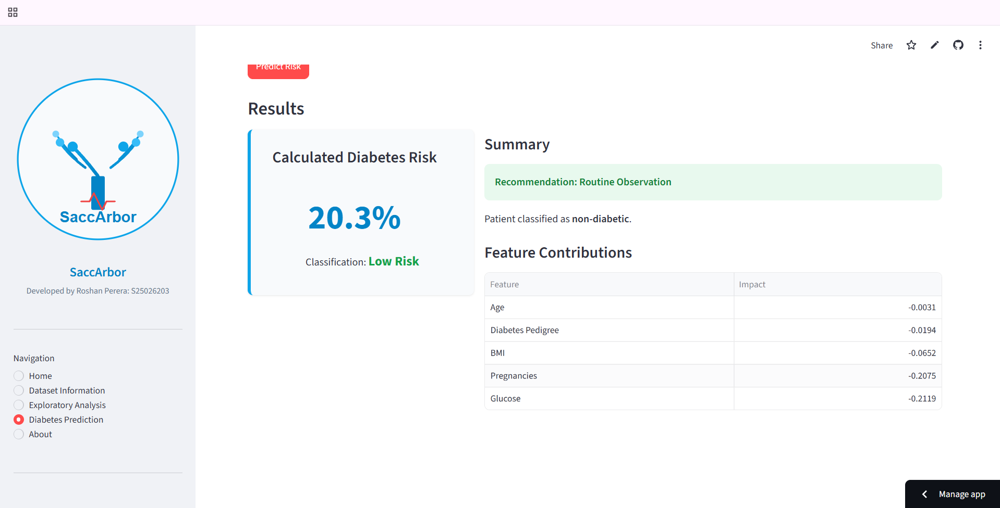
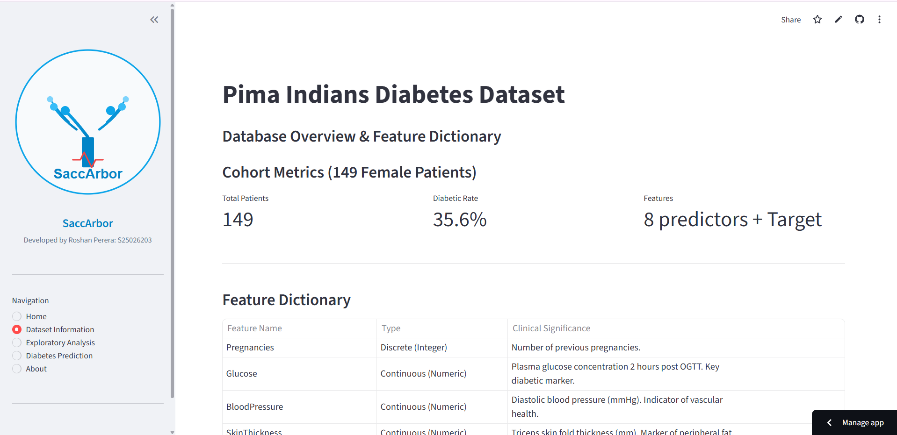
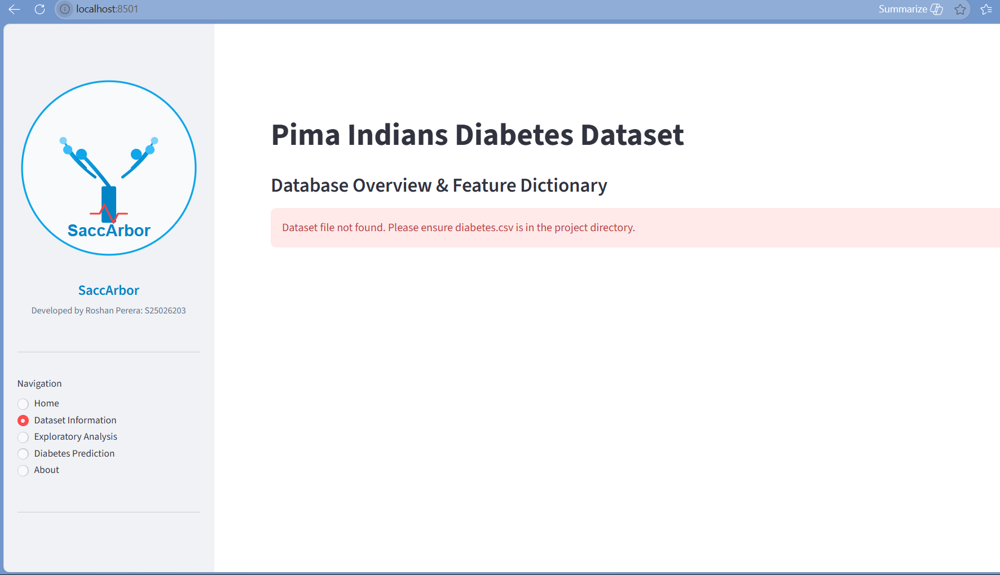
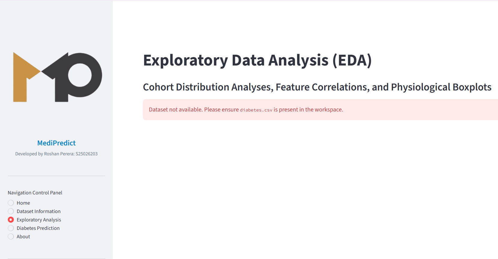
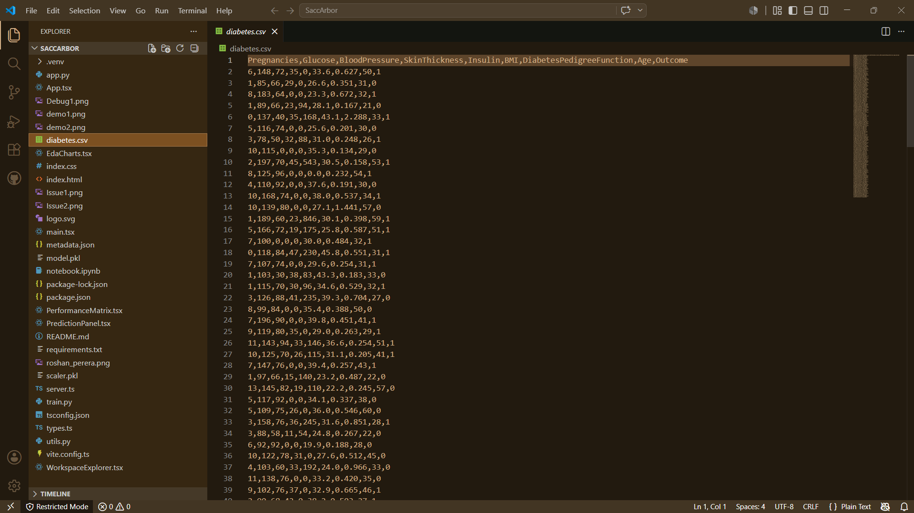

# 🩺 SaccArbor - AI-Powered Diabetes Risk Prediction Platform

[](https://www.python.org/)
[](https://www.typescriptlang.org/)
[](https://vitejs.dev/)
[](./LICENSE)

**SaccArbor** is a full-stack diagnostic decision-support tool that predicts diabetes risk from clinical measurements. It pairs a tuned **Random Forest** classifier - trained and evaluated on the Pima Indians Diabetes Dataset - with an interactive **React/TypeScript** dashboard, so predictions, model performance, and exploratory data analysis are all explorable in one place.


---

## ✨ Features

- **Risk Prediction Panel** - enter patient biomarkers and get an instant, model-backed risk classification
- **Performance Matrix** - live view of accuracy, precision, recall, F1, and ROC-AUC across candidate models
- **EDA Charts** - interactive exploratory visualizations of the underlying clinical dataset
- **Workspace Explorer** - browse dataset fields, feature engineering steps, and model artifacts from the UI
- **Reproducible ML pipeline** - a documented, leakage-safe training pipeline in Python, independent of the web app

---

## 🏗️ Architecture

SaccArbor is split into two cooperating layers:

| Layer | Stack | Responsibility |
|---|---|---|
| **Modeling** | Python (`train.py`, `utils.py`, `notebook.ipynb`) | Data cleaning, feature engineering, model selection, hyperparameter tuning, evaluation |
| **Application** | TypeScript + React + Vite (`App.tsx`, `server.ts`, component tree) | Dashboard UI, request handling, and presentation of predictions and metrics |

The Python pipeline produces the trained classifier and preprocessing artifacts; the TypeScript application serves the dashboard and routes prediction requests through `server.ts`.

---

## 📂 Project Structure

```
SaccArbor/
├── app.py                    # Python reference dashboard entry point
├── train.py                  # Model training & evaluation pipeline
├── utils.py                  # Preprocessing & serialization utilities
├── notebook.ipynb            # Exploratory analysis & experimentation notebook
├── diabetes.csv              # Pima Indians Diabetes Dataset
├── requirements.txt          # Python dependencies
│
├── App.tsx                   # Root React application component
├── main.tsx                  # React application entry point
├── PredictionPanel.tsx        # Risk prediction UI
├── PerformanceMatrix.tsx      # Model performance visualization
├── EdaCharts.tsx               # Exploratory data analysis charts
├── WorkspaceExplorer.tsx      # Dataset / artifact explorer UI
├── server.ts                  # Backend server for the web application
├── types.ts                   # Shared TypeScript types
├── index.html / index.css     # Application shell and styling
├── vite.config.ts / tsconfig.json
├── package.json / package-lock.json
└── metadata.json
```

---

## 🚀 Demo Screenshots

- Diabetes Prediction:<br><br>
  
- Dataset Information:<br><br>
  

---

## 🧬 Dataset & Clinical Context

Model training uses the **Pima Indians Diabetes Dataset**, originally curated by the National Institute of Diabetes and Digestive and Kidney Diseases.

- **Target (`Outcome`)** — binary diabetic diagnosis (1 = diabetic, 0 = non-diabetic)
- **Cohort** — 768 female patients of Pima Indian heritage, aged 21+
- **Features** — `Pregnancies`, `Glucose`, `BloodPressure`, `SkinThickness`, `Insulin`, `BMI`, `DiabetesPedigreeFunction`, `Age`

### 📚 Dataset Citation & Source

**Source**: National Institute of Diabetes and Digestive and Kidney Diseases (NIDDK)  
**Repository**: UCI Machine Learning Repository  
**Dataset URL**: https://archive.ics.uci.edu/ml/datasets/pima+indians+diabetes  
**Citation**:  
Smith, J.W., Everhart, J.E., Dickson, W.C., Knowler, W.C., & Johannes, R.S. (1988). *Using the ADAP learning algorithm to forecast the onset of diabetes mellitus*. In Proceedings of the Symposium on Computer Applications in Medical Care (pp. 261--265). IEEE Computer Society Press.

---

## 🔬 Modeling Pipeline

1. **Leakage-safe imputation** — biologically impossible zero-values (`Glucose`, `BloodPressure`, `SkinThickness`, `Insulin`, `BMI`) are imputed using medians computed *after* the train/test split, never before.
2. **Feature engineering** — derived features such as `Glucose_Age_Interaction` and `BMI_Insulin_Ratio` capture clinically meaningful interactions.
3. **Model comparison** — Logistic Regression, Decision Tree, Random Forest, SVM (RBF), and Gradient Boosting are evaluated under identical preprocessing.
4. **Hyperparameter tuning** — `GridSearchCV` sweeps Random Forest configurations across estimator count, depth, and leaf/split thresholds.

### Performance (80/20 stratified split)

| Model | Test Accuracy | CV Mean Accuracy | Precision | Recall | F1 | ROC-AUC |
|---|---|---|---|---|---|---|
| **Random Forest (Tuned)** | **78.57%** | **77.21%** | **73.33%** | **61.11%** | **66.67%** | **0.8412** |
| Logistic Regression | 77.27% | 76.45% | 71.11% | 59.26% | 64.65% | 0.8354 |
| Support Vector Machine | 76.62% | 76.10% | 70.21% | 61.11% | 65.35% | 0.8290 |
| Gradient Boosting | 75.32% | 74.80% | 65.96% | 57.41% | 61.39% | 0.8150 |
| Decision Tree | 72.08% | 71.56% | 61.22% | 55.56% | 58.25% | 0.7180 |

The tuned Random Forest is used in production for its balance of ROC-AUC and F1 score.

---

## 🚀 Deployment

- **Frontend/app**: build with `npm run build` and deploy the static output (e.g. Vercel, Netlify) alongside the `server.ts` backend.
- **Model pipeline**: re-run `train.py` whenever the dataset or feature set changes, and redeploy the resulting artifacts.

---

## 🧬 Images of Issues and Debugging

- Issue:<br><br>
  
  <br><br>
- Debugging:<br><br>
  

---

## 🗺️ Roadmap

- [ ] Persist prediction history per session
- [ ] Add model explainability (SHAP) to the Performance Matrix view
- [ ] Containerize the full stack with Docker Compose
- [ ] CI pipeline for automated retraining and testing

---

## 📄 License

Licensed under the MIT License — see [`LICENSE`](./LICENSE) for details.

## ✍️ Author

**Roshan Perera** ([@RoshanP2026](https://github.com/RoshanP2026))<br>
**ID** ([S25026203](S25026203))<br><br>


<div class="footer-column">
      <p class="copyright">&copy; 2026 SaccArbor. All rights reserved.</p>
    </div>
